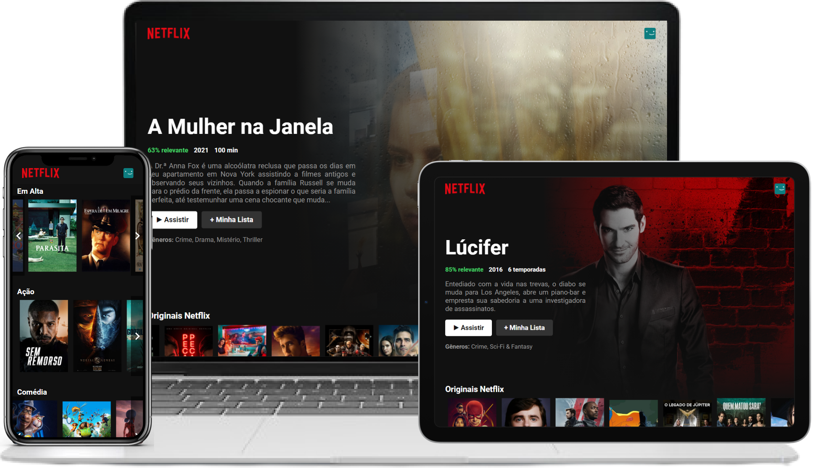

<h1 align="center">
  
</h1>

  <a href="#-tecnologias">Tecnologias</a>&nbsp;&nbsp;&nbsp;|&nbsp;&nbsp;&nbsp;
  <a href="#-projeto">Projeto</a>&nbsp;&nbsp;&nbsp;|&nbsp;&nbsp;&nbsp;
  <a href="#-como-executar">Como executar</a>

 

  

## 🚀 Tecnologias

Esse projeto foi desenvolvido com as seguintes tecnologias:

- [React](https://reactjs.org)
- [Next.js](https://nextjs.org)
- [TypeScript](https://www.typescriptlang.org)

## 💻 Projeto

<h4> Acesse em: https://netflix-ui-clone-marcelino.vercel.app </h4>

O projeto consiste em um clone (sem o intúito de ser 100% fiel) da interface da página principal do site da [Netflix](https://netflix.com), utilizando os dados de filmes e séries gerados pela API do [TheMovieDB](https://www.themoviedb.org)

## 🚀 Como executar

- Clone o repositório
- Instale as dependências com `yarn`
- Crie uma conta no TheMovieDB e gere sua `api key`
- Vá em `src/services/Tmdb.ts` e altere o valor da `const API_KEY` pelo valor da sua `api key`
- Inicie o servidor com `yarn dev`

Agora você pode acessar [`localhost:3000`](http://localhost:3000) do seu navegador.

---

<h4 align="center"> Feito com ♥ por Marcelino Teixeira </h4>
